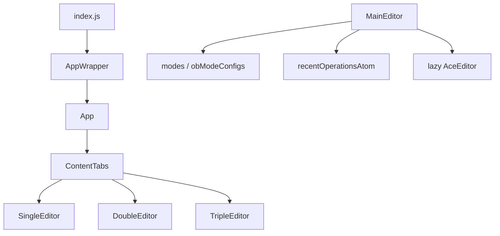

# 12. Quality gates, TODOs, checklist

---

## 12.1 Tests and hooks

- **`npm test`** → [`scripts/health-checks/all-is-well.sh`](../../../scripts/health-checks/all-is-well.sh) (Node version, npm install, etc.).
- **Husky** (`package.json`): `pre-commit` / `pre-push` run `npm test`.
- **Mocha:** [`test/application.test.js`](../../../test/application.test.js) loads `server/application.js`.

---

## 12.2 ESLint

Flat configs: [`eslint.config.js`](../../../eslint.config.js), [`src/eslint.config.js`](../../../src/eslint.config.js).

---

## 12.3 Known TODOs (from source comments)

- `getSanitizedOperationWithStatus` fallback to `arrOperations[0]` may be wrong default.
- Duplicate empty-input / file paths.
- `/admin` lacks access control.
- Response `finish` listener leak concern.
- Morgan / structured access logging TODO.
- Full-screen editor button TODO in `MainEditor`.

---

## 12.4 Dependency graph

---

## 12.5 Adding a new operation

1. Add `configYourOp.js` under `modes/modeX/` with unique `operationId`.
2. Register in that mode’s `index.js` `operations` optgroups; keep `arrOperations` / `obOperations` pattern.
3. Update [`constOperations.js`](../../../src/App/Dashboard/MainEditor/constOperations.js) if defaults/recommended lists need changes.
4. New **mode**: new `modeX/index.js`, [`modes/index.js`](../../../src/App/Dashboard/MainEditor/modes/index.js), `readable` + save extension in `MainEditor.js`, `modes` sanitization list.
5. Match `operationInputType` / `operationOutputType` to `performOperation` return shape.
6. Run ESLint + `npm test`.

---

**Prev:** [11-webpack-and-configuration.md](./11-webpack-and-configuration.md)  
**Index:** [README.md](./README.md) · [Specifications home](../README.md)
